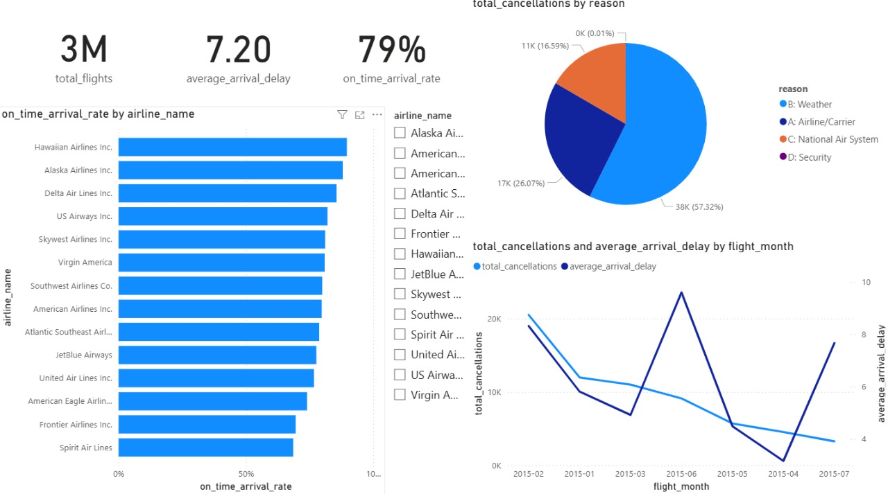

# ✈️ Airlines Data Analysis Dashboard

## 📖 Introduction

This project presents an in-depth analysis of US airline performance data from 2015. The goal is to uncover trends and insights related to flight delays, cancellations, and on-time arrival rates for various airlines. A dynamic and interactive dashboard was created using **Power BI** to visualize these key performance indicators. The data was processed and managed using **SQL**.

---

## ✨ Key Insights & Features

The dashboard provides a high-level overview and allows for deeper exploration of the data. Here are some of the key metrics and findings:

* **Total Flights Analyzed:** 3 Million
* **Overall On-Time Arrival Rate:** 79%
* **Average Arrival Delay:** 7.20 minutes
* **Primary Cause of Cancellations:** The **National Air System** is the leading cause of flight cancellations, accounting for over 57% of the total.
* **Monthly Trends:** The analysis reveals significant fluctuations in cancellations and delays by month, with February and June showing peaks in cancellations.
* **Top Performing Airlines:** **Hawaiian Airlines Inc.** and **Alaska Airlines Inc.** demonstrate the highest on-time arrival rates.

---

## 📊 Dashboard Visuals

Here is a snapshot of the main dashboard, showcasing the key metrics and visualizations.



---

## 🛠️ Technologies Used

This project was built using the following tools and technologies:

* **Database:** SQL (for data querying and management)
* **Data Visualization:** Microsoft Power BI (for creating the interactive dashboard)

---

## 🚀 How to Use

To set up and run this project on your local machine, follow these steps:

1.  **Download the files from:**
    ```bash
    https://drive.google.com/drive/folders/1C7AYUX__N8JkwZfQDoDcGXKUqZEZciBE?usp=sharing
    ```
2.  **Database Setup:**
    * Set up a SQL server.
    * Run the provided `.sql` script to create the necessary tables and import the data.
3.  **Power BI Dashboard:**
    * Open the `Airlines Data.pbix` file using Power BI Desktop.
    * If prompted, update the data source credentials to connect to your local SQL server.
4.  **Explore:**
    * Interact with the dashboard to explore the data and insights.

---

## 📄 License

This project is licensed under the MIT License. See the [LICENSE](LICENSE) file for more details.
